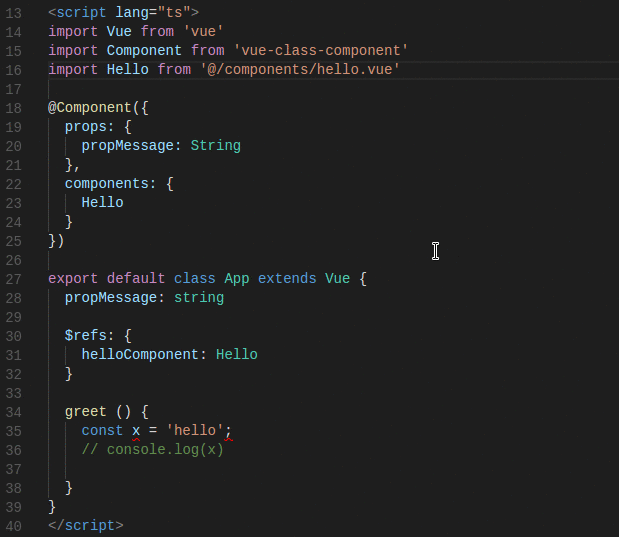

# vscode-tslint-vue

 

[VSCode extension](https://marketplace.visualstudio.com/items?itemName=prograhammer.tslint-vue) for [tslint](https://github.com/palantir/tslint) with added support for .vue (single file component) files and compiler/typechecker level linting.



# Quick Setup

### Set Script lang

For linting to work in `.vue` files, you need to ensure your script tag's language attribute is set
to `ts` or `tsx` (also make sure you include the `.vue` extension in all your import statements as shown below): 

```html
<script lang="ts">
import Hello from '@/components/hello.vue'

// ...

</script>
```

### Enable typeCheck

You can turn on linting at the typechecker level by setting the `typeCheck` tslint option to `true` in your settings.json (File > Preferences > Settings - Workspace):

```json
// .vscode/settings.json
{
  // ...

  "tslint.typeCheck": true, 

  // ...
}

```

**Important**: Importing vue modules (ie. `import Hello from 'Hello.vue'`) will work fully within other .vue files (type information is retrieved) 
without the need for a wildcard declaration. However, `.ts` modules that import `.vue` modules still require the wildcard declaration file:

```
// sfc.d.ts
declare module "*.vue" {
    import Vue from "vue"  // <-- this is not ideal, v2.0.0 will fix this!
    export default Vue
}

```
The above will give the type as `vue` which is not ideal and defeats the purpose of TypeScript (your Vue modules extend Vue with more type information 
that you have added on your module).
 I've found a solution to this and I'm currently working on preparing it for **a 2.0.0 release** where the wildcard definition will no longer
be needed and type information from the module **will fully work!** Star the github repo 
and watch this issue: https://github.com/prograhammer/vscode-tslint-vue/issues/4. In the meantime, you can double check yourself using the 
Webpack plugin `fork-ts-checker-webpack-plugin`. See Webpack section further down below.


### Setup tsconfig.json

This extension assumes you have a `tsconfig.json` file located at the root of your current project/workspace. In your tsconfig file, ensure you don't exclude `.vue` files and also provide the wildcard path alias `@` so that it points to `src`:

```json
// tsconfig.json
{
  "include": [
    "src/**/*.ts",
    "src/**/*.vue"
  ],
  "exclude": [
      "node_modules"
  ],
  "compilerOptions": {
    
    // ...

    "baseUrl": ".",
    "paths": {
      "@/*": [
        "src/*"
      ]
    }
  }
}

```

### Setup tslint.json

Add a `tslint.json` file. For a quick set of rules you can use the [Javascript Standard Style](https://standardjs.com/rules.html)
wit `npm install tslint-config-standard --save-dev` and add it to the `extends` section as shown below:

```json
{
    "defaultSeverity": "error",
    "extends": [
        "tslint-config-standard" // <-- Don't forget to npm install this package.
    ],    
    "jsRules": {},
    "rules": {},
    "rulesDirectory": []
}

```

### Webpack

If you are using Webpack you will mostly likely need a way to perform linting in your build process as well. Check out the 
fast `fork-ts-checker-webpack-plugin` (which works with ts-loader set to transpileOnly) where I currently have a pull-request for adding 
Vue functionality. You can try it out early and read more at this [issue here](https://github.com/Realytics/fork-ts-checker-webpack-plugin/issues/70).

### VNext

- This is a fork of [vscode-tslint](https://marketplace.visualstudio.com/items?itemName=eg2.tslint) so you can find more information there. Soon 
I will update this code to fork from the newer, improved extension TSLint (vnext) [vscode-ts-tslint](https://marketplace.visualstudio.com/items?itemName=eg2.ts-tslint). Please refer to the tslint [documentation](https://github.com/palantir/tslint) for how to configure the linting rules.

### Prerequisites
The extension requires that the `tslint` and `typescript` modules are installed either locally or globally. The extension will use the tslint module that is installed closest to the linted file. You can switch 
the typescript version at the bottom right of the status bar to use the workspace/local version (will update your settings.json). 
To install tslint and typescript globally you can run `npm install -g tslint typescript`

## Development setup
- run npm install inside the `tslint` and `tslint-server` folders
- open VS Code on `tslint` and `tslint-server`

## Developing the server
- open VS Code on `tslint-server`
- run `npm run compile` or `npm run watch` to build the server and copy it into the `tslint` folder
- to debug press F5 which attaches a debugger to the server
- to trace the server communication you can enable the setting: "tslint.trace.server": "verbose", "messages"

## Developing the extension/client
- open VS Code on `tslint`
- run F5 to build and debug the extension

> If you want to debug server and extension at the same time; 1st debug extension and then start server debugging

## Publishing to marketplace

- Make sure you have `vsce` installed: `npm install -g vsce`.
- To publish (from the tslint directory): `vsce publish`.