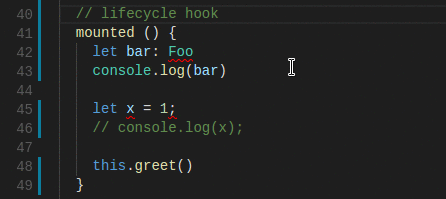

# vscode-tslint-vue

 

[VSCode extension](https://marketplace.visualstudio.com/items?itemName=prograhammer.tslint-vue) for [tslint](https://github.com/palantir/tslint) with added support for .vue (single file component) files and compiler/typechecker level linting.



# Quick Setup

- For linting to work in `.vue` files, you need to ensure your script tag's language attribute is set
to `ts`: 

```html
<script lang="ts">...</script>  
```

- You can turn on linting at the typechecker level by setting the `typeCheck` tslint option to `true` in your settings.json (File > Preferences > Settings - Workspace):

```json
// .vscode/settings.json
{
  // ...

  "tslint.typeCheck": true, 

  // ...
}

```

- This extension assumes you have a `tsconfig.json` file located at the root of your current project/workspace. In your tsconfig file, ensure you don't exclude `.vue` files and also provide the wildcard path alias `@` so that it points to `src`:

```json
// tsconfig.json
{
  "include": [
    "src/**/*.ts",
    "src/**/*.vue"
  ],
  "exclude": [
      "node_modules"
  ],
  "compilerOptions": {
    
    // ...

    "baseUrl": ".",
    "paths": {
      "@/*": [
        "src/*"
      ]
    }
  }
}

```

- This is a fork of [vscode-tslint](https://marketplace.visualstudio.com/items?itemName=eg2.tslint). Soon I will update this code to fork from the newer, improved extension TSLint (vnext) [vscode-ts-tslint](https://marketplace.visualstudio.com/items?itemName=eg2.ts-tslint). Please refer to the tslint [documentation](https://github.com/palantir/tslint) for how to configure the linting rules.

## Development setup
- run npm install inside the `tslint` and `tslint-server` folders
- open VS Code on `tslint` and `tslint-server`

## Developing the server
- open VS Code on `tslint-server`
- run `npm run compile` or `npm run watch` to build the server and copy it into the `tslint` folder
- to debug press F5 which attaches a debugger to the server
- to trace the server communication you can enable the setting: "tslint.trace.server": "verbose", "messages"

## Developing the extension/client
- open VS Code on `tslint`
- run F5 to build and debug the extension

> If you want to debug server and extension at the same time; 1st debug extension and then start server debugging

## Publishing to marketplace

- Make sure you have `vsce` installed: `npm install -g vsce`.
- To publish (from the tslint directory): `vsce publish`.